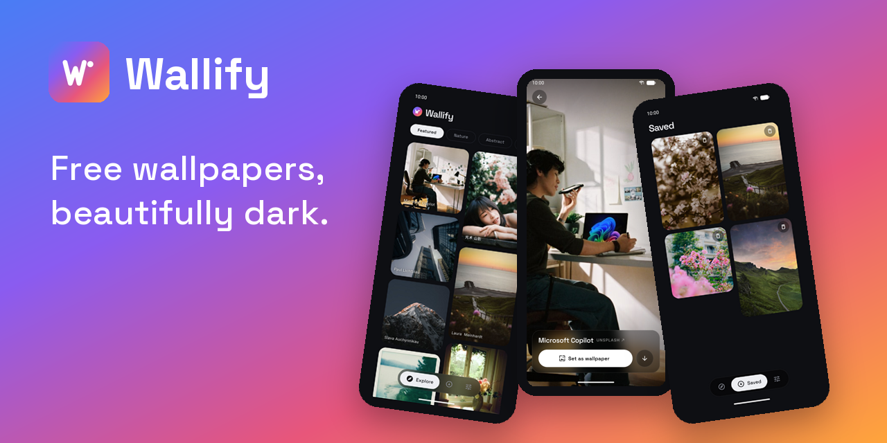
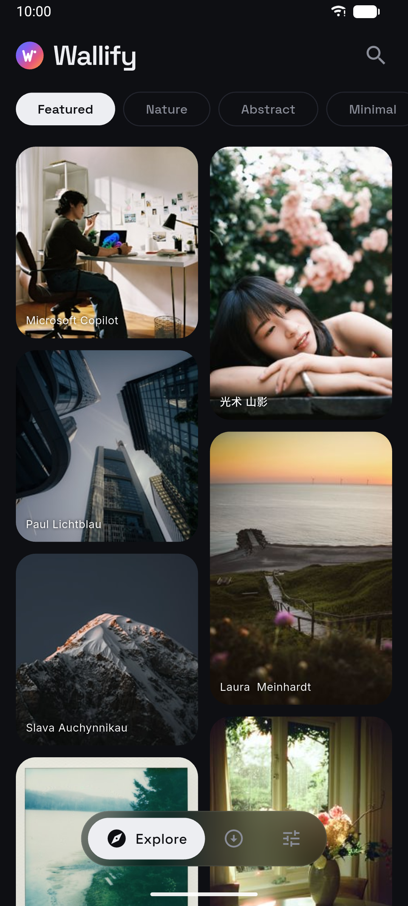
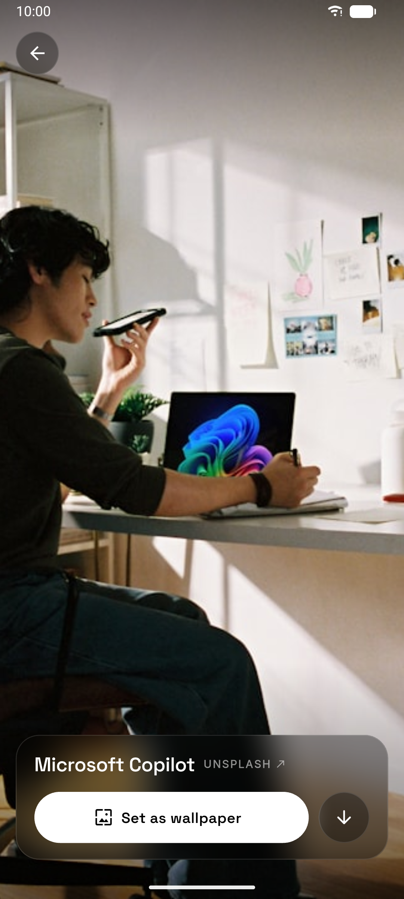
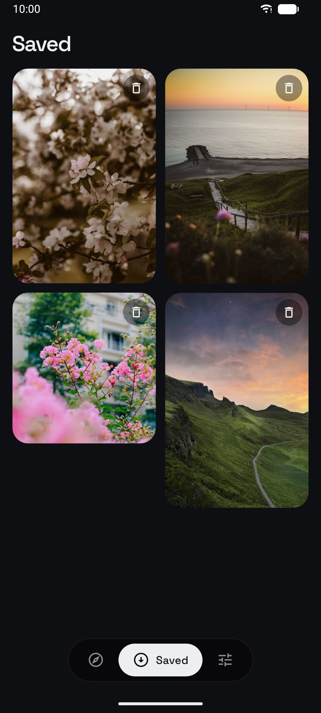
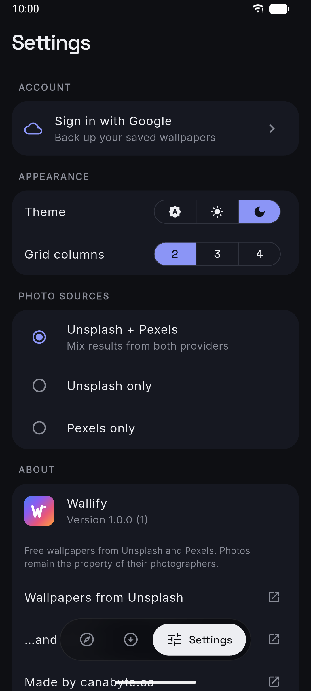

<p align="center">
  
</p>

<h1 align="center">Wallify</h1>

<p align="center">
  Free wallpapers from <a href="https://unsplash.com">Unsplash</a> and <a href="https://www.pexels.com">Pexels</a> —
  browse, save, and set them in one tap.<br/>
  Flutter · Android · iOS · macOS
</p>

---

## Features

- **Endless wallpapers** — Unsplash and Pexels feeds, merged and interleaved, browsable by category (Featured, Nature, Abstract, Minimal, …) with debounced search
- **One-tap set** — Android sets home/lock/both with a pixel-perfect center-crop at your exact screen resolution; macOS sets the desktop picture; iOS saves to Photos
- **Cloud backup** — optional Google Sign-In backs your library up to Firestore; sign in on a new device and everything comes back, with image files re-fetched on demand
- **Offline-first** — your saved wallpapers live in SQLite on the device; the cloud is a mirror, never a requirement
- **Quiet, dark design** — ink-black canvas, frosted-glass navigation, photos front and center

<p align="center">
  
</p>

## Screenshots

| Explore | Detail | Saved | Settings |
|---|---|---|---|
|  |  |  |  |

## Getting started

```bash
cd sample_app
flutter pub get

# API keys are not committed. Copy the template and add your free keys
# (https://unsplash.com/developers, https://www.pexels.com/api/):
cp api_keys.example.json api_keys.json   # then edit it

flutter run --dart-define-from-file=api_keys.json
```

Google Sign-In / cloud backup additionally needs your own Firebase project
(`flutterfire configure`, enable Google auth + Firestore, deploy
[`firestore.rules`](firestore.rules)) — the app runs fine without it; the
Account section simply stays hidden.

## Architecture

- `lib/src/data/` — HTTP clients, repository (merges both providers), SQLite (`sqflite`), streaming download service, Firestore sync behind a `CloudDownloadStore` abstraction
- `lib/src/state/` — `provider` + `ChangeNotifier` controllers (explore feeds, downloads, search, settings, auth)
- `lib/src/platform/` — one `MethodChannel` (`wallify/platform`) for native wallpaper setting per OS
- `lib/src/ui/` — theme tokens, masonry grids with Hero transitions, glass panels

SQLite is the source of truth; cloud sync is write-through and can never fail a local operation. Unit tests run against real SQLite (via `sqflite_common_ffi`) and in-memory cloud fakes — no Firebase needed for `flutter test`.

## Attribution

Photos are the property of their photographers, served by
[Unsplash](https://unsplash.com) and [Pexels](https://www.pexels.com); the
app displays attribution and reports Unsplash downloads per their API terms.

Made by [canabyte.ca](https://canabyte.ca)
